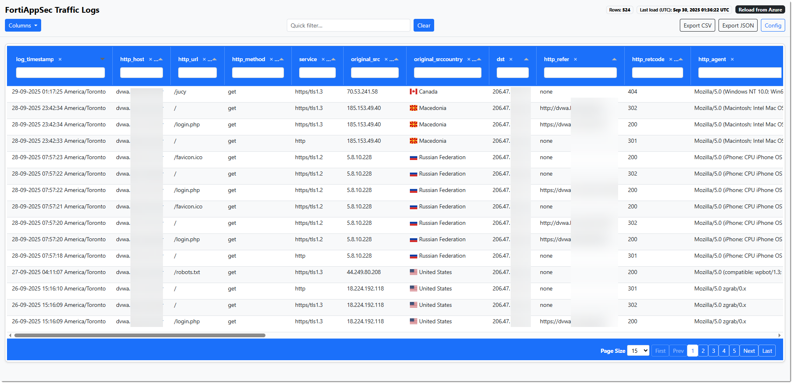
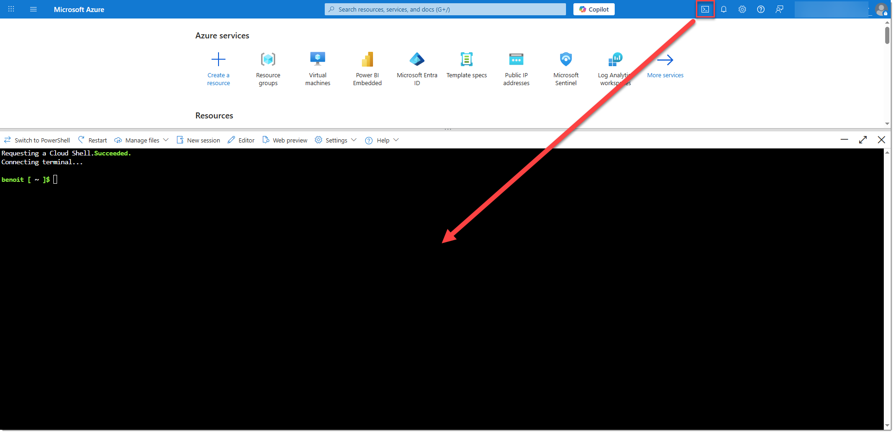
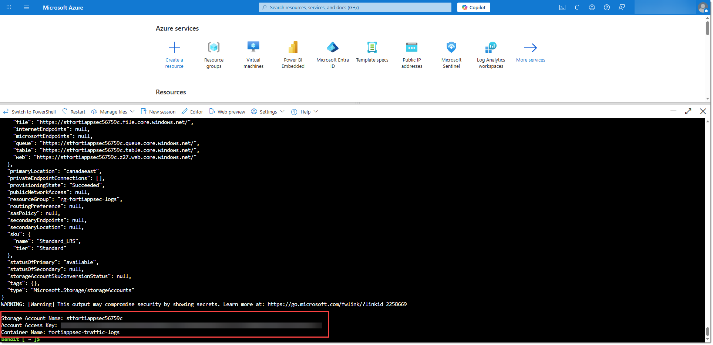
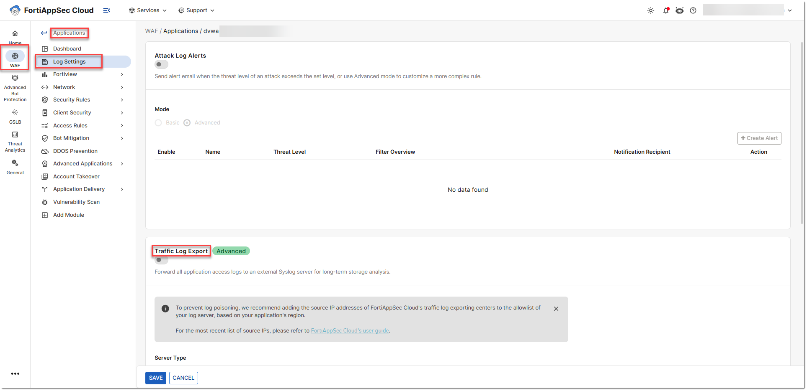
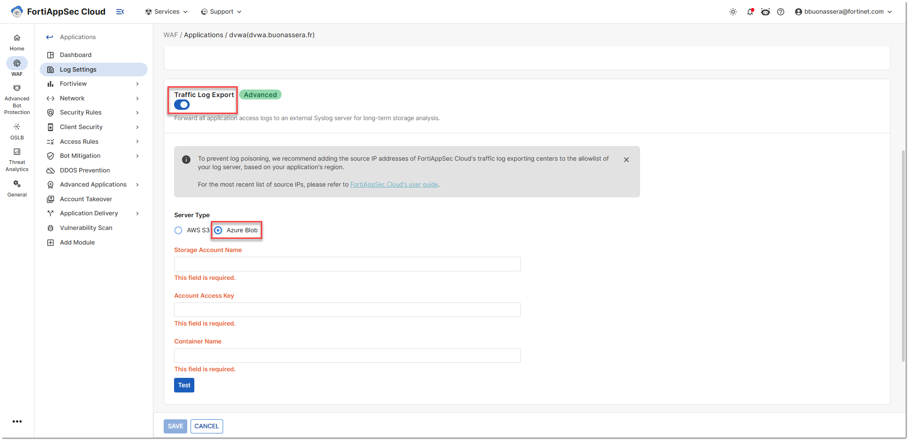
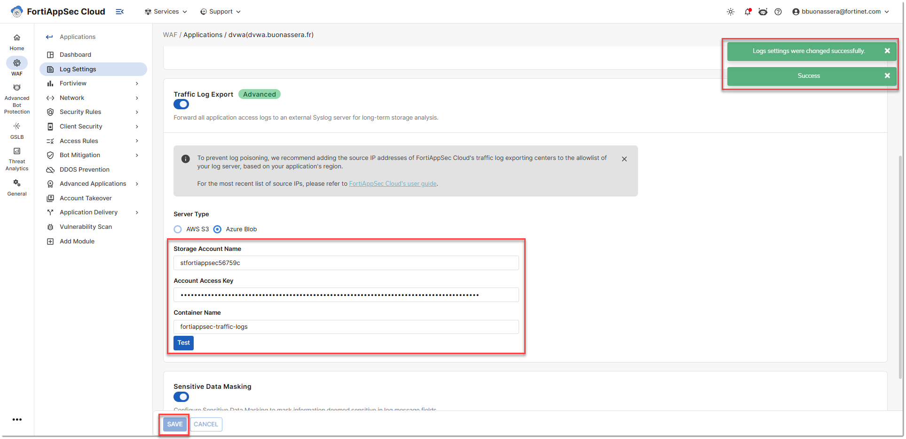
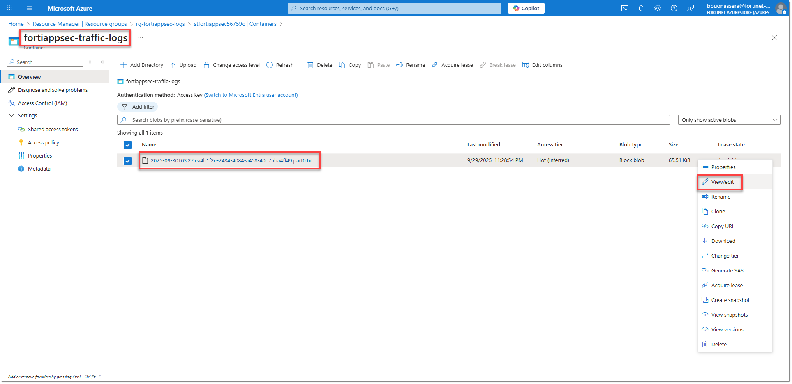
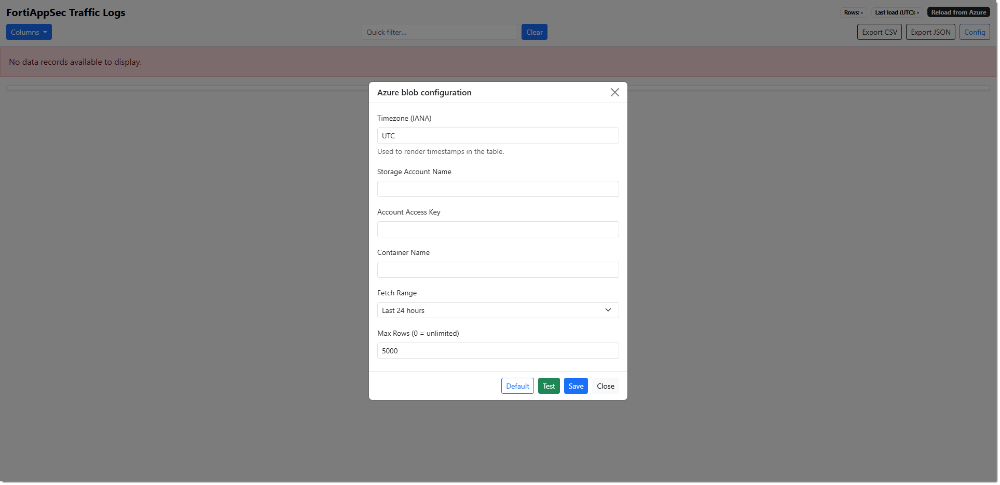

# FortiAppSec Traffic Logs Viewer

A compact web UI to browse **FortiAppSec Cloud traffic logs** exported in **Azure Blob Storage**.  



---

## ✨ Features
- Log viewer with quick filters and header filters  
- Column picker (show/hide any field)  
- Download logs in **CSV/JSON** format  
- Configure parameters via **.env file** or the **GUI**  

---

## 📋 Configuration Steps
1. Create an **Azure Storage Account & Container** where **FortiAppSec Cloud Traffic Logs** are exported.  
2. Configure **FortiAppSec Cloud** to export traffic logs to Azure.  
3. Run the app (Docker or Python).  

---

## 🧭 Step-by-step Setup

### 1) Create Azure Storage Account & Container

Open your browser and sign in to [Azure Portal](https://portal.azure.com/).  
Click the **Cloud Shell** button in the top-right corner.  



Run the following commands (adapt the names and IPs as needed):

```bash
# Define the Resource Group name
export RESOURCE_GROUP_NAME="rg-fortiappsec-logs"

# Define the Azure region
export REGION="canadaeast"

# Define the Storage Account name (must be globally unique)
# Add random characters at the end to avoid conflicts
export STORAGE_ACCOUNT_NAME="stfortiappsec$(openssl rand -hex 3 | tr -d '\n' | cut -c1-6)"

# Define the Container name for storing FortiAppSec WAF logs
export CONTAINER_NAME="fortiappsec-traffic-logs"

# Define the list of authorized IP addresses (FortiAppSec Cloud Management + Log exporters + App location)
# https://docs.fortinet.com/document/fortiappsec-cloud/latest/user-guide/681595/log-settings
export FORTIAPPSEC_IPS=(
  "3.226.2.163"      # FortiAppSec Cloud Management
  "3.123.68.65"      # FortiAppSec Cloud Management
  "52.60.181.20"     # AWS Canada Central (Montreal)
  "52.237.13.214"    # Azure Canada Central (Toronto)
  "70.53.241.58"     # FortiAppSec Cloud Log Viewer Application
)

# Create a Resource Group in the selected region
az group create \
  --name $RESOURCE_GROUP_NAME \
  --location $REGION

# Create a Storage Account (must be unique across all Azure)
az storage account create \
  --name $STORAGE_ACCOUNT_NAME \
  --resource-group $RESOURCE_GROUP_NAME \
  --location $REGION \
  --sku Standard_LRS \
  --kind StorageV2 \
  --https-only true

# Create a Blob container inside the Storage Account
az storage container create \
  --name $CONTAINER_NAME \
  --account-name $STORAGE_ACCOUNT_NAME

# Disable default network access (deny all by default)
az storage account update \
  --name $STORAGE_ACCOUNT_NAME \
  --resource-group $RESOURCE_GROUP_NAME \
  --default-action Deny

# Loop through the FORTIAPPSEC_IPS list and add each IP to the firewall rules
for ip in "${FORTIAPPSEC_IPS[@]}"; do
  az storage account network-rule add \
    --resource-group $RESOURCE_GROUP_NAME \
    --account-name $STORAGE_ACCOUNT_NAME \
    --ip-address $ip
done

# Get the primary access key of the Storage Account
ACCESS_KEY=$(az storage account keys list \
  --resource-group $RESOURCE_GROUP_NAME \
  --account-name $STORAGE_ACCOUNT_NAME \
  --query '[0].value' \
  --output tsv)

# Display the required values for FortiAppSec Cloud configuration
echo "---------------------------------------------"
echo "Storage Account Name: $STORAGE_ACCOUNT_NAME"
echo "Account Access Key: $ACCESS_KEY"
echo "Container Name: $CONTAINER_NAME"
```



---

### 2) Configure FortiAppSec Cloud → Azure Blob

1. In the **FortiAppSec Cloud Portal**, go to:  
   **WAF menu > Applications > Your Application > Log Settings**.  

  

2. Enable **Traffic Log Export** and select **Azure Blob**.  

  

3. Fill the fields:  
   - **Storage Account Name** → your Azure storage account (e.g., `stfortiappsec`)  
   - **Account Access Key** → the key copied earlier  
   - **Container Name** → the container name (e.g., `fortiappsec-traffic-logs`)  

4. Click **Test**.  

5. Save if successful.  

  

7. Notes:  
   - Traffic log timestamps are **recorded in UTC**. This log viewer app lets you set a timezone to display logs in your local time.  
   - Export is **near real time**; the app reads NDJSON lines as they arrive in the Azure container.  

8. Generate some traffic to your site. After a few seconds you should see the logs appear in the Azure portal.



---

### 3) Install the Application

Clone the repo:
```bash
git clone https://github.com/benoitbMTL/fortiappsec-traffic-log-viewer.git
cd fortiappsec-traffic-logs-viewer
```

---

### 4) Set Azure Storage Credentials in .env

Use `.env.example` as a template:  
```bash
cp .env.example .env
```

Fill the mandatory values:

```bash
# --- Azure Storage ---
AZURE_STORAGE_ACCOUNT=your_storage_account_name
AZURE_STORAGE_KEY=your_access_key
AZURE_CONTAINER=fortiappsec-traffic-logs
```

The app fetches logs **directly from Azure** using these values.

---

### 5) Run the Application

#### Option A — Local (`run.sh`)

A helper script is included to create a venv, install deps, and start the app:

```bash
chmod +x run.sh
./run.sh
```

Open: [http://localhost:8000](http://localhost:8000)  

If `.env` does not exist, the application will ask for Azure storage credentials.  

  

#### Option B — Docker

**Build** the image:
```bash
docker build -t fortiappsec-traffic-logs:latest .
```

**Run** the container (reads `.env` for Azure credentials):
```bash
docker run -d --restart unless-stopped \
  --name fortiappsec-traffic-logs \
  --env-file .env \
  -p 8000:8000 \
  fortiappsec-traffic-logs:latest
```

Open: [http://localhost:8000](http://localhost:8000)  

If `.env` does not exist, the application will ask for Azure credentials. 

  

---

## 📦 Requirements (Python)
- flask  
- azure-storage-blob  
- pandas  
- pyarrow  
- python-dotenv  
- gunicorn  

`run.sh` installs all dependencies automatically.  

---

## 📚 References
- [Fortinet Documentation — FortiAppSec Log Settings](https://docs.fortinet.com/document/fortiappsec-cloud/latest/user-guide/681595/log-settings)
